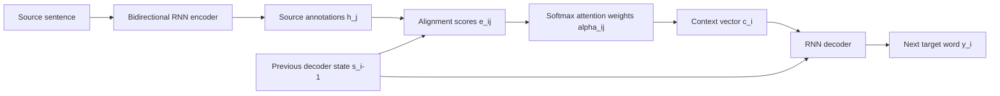



## One-Line Takeaway

This paper introduces a neural machine translation model that learns **where to look in the source sentence while generating each target word**, removing the fixed-length context bottleneck of early encoder-decoder models.

## Metadata

| Item | Detail |
|------|--------|
| Paper | Neural Machine Translation by Jointly Learning to Align and Translate |
| Authors | Dzmitry Bahdanau, Kyunghyun Cho, Yoshua Bengio |
| Venue | ICLR 2015 oral presentation |
| First arXiv submission | 2014-09-01 |
| Task | English-to-French neural machine translation |
| Core keywords | RNN Encoder-Decoder, soft alignment, attention, BiRNN encoder, RNNsearch |
| Links | [arXiv](https://arxiv.org/abs/1409.0473) · [HTML paper](https://ar5iv.labs.arxiv.org/html/1409.0473) |

## Why I Read This

This is one of the papers that made **attention** a central idea in deep learning. Before reading Transformer-style self-attention, it is useful to understand why attention was introduced in sequence-to-sequence translation: early NMT models compressed the whole source sentence into one vector, and that single vector became a bottleneck, especially for long sentences.

## Problem

Earlier encoder-decoder NMT models encode the entire source sentence into one fixed-length vector \(c\). The decoder then generates every target word from that same compressed representation.

The paper argues that this design is weak because:

- Long sentences contain too much information to store reliably in one vector.
- The decoder needs different source words at different generation steps.
- Translation often requires soft, non-monotonic alignment rather than a single hard word mapping.

## Key Idea

Instead of forcing the encoder to produce one sentence vector, the encoder produces a sequence of annotations:

\[
h_1, h_2, \ldots, h_{T_x}
\]

At each target step \(i\), the decoder computes attention weights over all source annotations and builds a step-specific context vector:

\[
c_i = \sum_{j=1}^{T_x} \alpha_{ij} h_j
\]

The model therefore decides which source positions are relevant **for the current target word**, not once for the entire sentence.

## Method

### Encoder

The encoder is a bidirectional RNN. For each source position \(j\), it concatenates the forward and backward hidden states:

\[
h_j = [\overrightarrow{h_j}; \overleftarrow{h_j}]
\]

This gives each source-word annotation information from both left and right context.

### Alignment Model

For each target step \(i\) and source position \(j\), the model computes an alignment score:

\[
e_{ij} = a(s_{i-1}, h_j)
\]

Here, \(s_{i-1}\) is the previous decoder hidden state and \(a(\cdot)\) is a learned feed-forward network. The scores are normalized with softmax:

\[
\alpha_{ij} =
\frac{\exp(e_{ij})}{\sum_{k=1}^{T_x} \exp(e_{ik})}
\]

These \(\alpha_{ij}\) values are differentiable soft-alignment weights, so the alignment mechanism can be trained jointly with the translation model by backpropagation.

### Decoder

The decoder predicts the next target word using:

- the previous target word,
- the previous decoder state,
- the current context vector \(c_i\).

This differs from the basic encoder-decoder because every decoding step receives a different context vector.

## Experiments

The authors evaluate on WMT 2014 English-to-French translation. They compare a basic RNN encoder-decoder with the proposed attention-based model, called **RNNsearch**.

| Model | BLEU, all sentences | BLEU, no UNK |
|------|---------------------:|-------------:|
| RNNencdec-30 | 13.93 | 24.19 |
| RNNsearch-30 | 21.50 | 31.44 |
| RNNencdec-50 | 17.82 | 26.71 |
| RNNsearch-50 | 26.75 | 34.16 |
| RNNsearch-50* | 28.45 | 36.15 |
| Moses phrase-based SMT | 33.30 | 35.63 |

The important result is not only the overall BLEU improvement. The attention model is much more robust for longer sentences, while the fixed-vector encoder-decoder degrades as sentence length increases.

## What I Learned

The main contribution is the shift from **sentence-level compression** to **step-level retrieval**. The encoder stores a sequence of useful representations, and the decoder retrieves what it needs at each generation step.

This also makes the model more interpretable than a plain encoder-decoder. Visualizing attention weights gives a rough source-target alignment matrix, which helps explain how the translation was produced.

For my Transformer study, this paper is a good bridge:

- Bahdanau attention uses an RNN decoder state to attend over encoder states.
- Transformer attention removes recurrence and uses attention as the main computation.
- The motivation remains similar: let the model select relevant context instead of relying on one compressed representation.

## Implementation Notes

If I implement this in PyTorch, I would split the model into four modules:

1. `Encoder`: bidirectional GRU/LSTM that returns all hidden states.
2. `AdditiveAttention`: feed-forward alignment network for \(e_{ij}\).
3. `Decoder`: recurrent decoder that consumes \(c_i\) at each step.
4. `Seq2Seq`: training wrapper with teacher forcing and beam-search inference.

Important checks:

- Verify attention weights sum to 1 over source positions.
- Plot attention heatmaps for short examples.
- Compare short-sentence and long-sentence performance separately.
- Track unknown-token behavior, because rare words remain a key limitation in this paper.

## Limitations and Questions

- The shortlist vocabulary maps rare words to `UNK`, so rare-word translation is still weak.
- Attention requires computing source-target pair scores, which scales with both input and output length.
- Attention heatmaps are useful diagnostics, but they should not automatically be treated as a complete explanation of model behavior.
- The paper focuses on English-to-French; I want to compare whether the same behavior appears in Korean-English or lower-resource settings.

## Follow-Up Reading

- Cho et al., "Learning Phrase Representations using RNN Encoder-Decoder for Statistical Machine Translation"
- Sutskever et al., "Sequence to Sequence Learning with Neural Networks"
- Vaswani et al., "Attention Is All You Need"

## Reference

- [arXiv:1409.0473](https://arxiv.org/abs/1409.0473)
- [HTML version via ar5iv](https://ar5iv.labs.arxiv.org/html/1409.0473)
